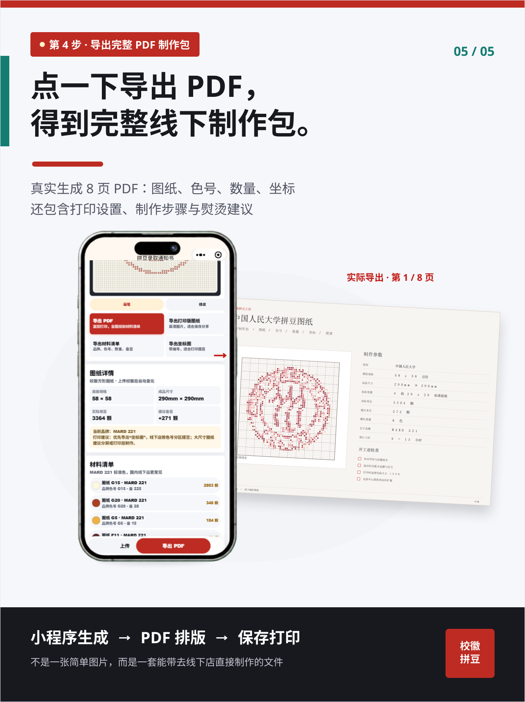

# 录取拼豆工坊

一个面向微信小程序的高校校徽拼豆图纸生成器。用户可以选择学校或上传图片，将校徽量化为指定品牌色号的拼豆图纸，并导出制作 PDF。

> 本项目不是高校官方产品，不生成或验证真实录取资格。高校名称、校徽和商标归各自权利人所有。

<p align="center">
  
</p>

## 产品流程

选择学校或上传校徽，生成可辨认的拼豆图纸，核对品牌色号与用量，最后导出完整 PDF 制作包。

<table>
  <tr>
    <td width="50%"></td>
    <td width="50%"></td>
  </tr>
  <tr>
    <td align="center"><strong>选择学校</strong><br>从院校索引检索，也可以上传自己的校徽图片</td>
    <td align="center"><strong>生成图纸</strong><br>预览圆豆或方格效果，调整画质与网格</td>
  </tr>
  <tr>
    <td width="50%"></td>
    <td width="50%"></td>
  </tr>
  <tr>
    <td align="center"><strong>核对材料</strong><br>按品牌统计色号、数量、底板和成品尺寸</td>
    <td align="center"><strong>导出制作包</strong><br>生成包含坐标、清单与制作建议的八页 PDF</td>
  </tr>
</table>

## 功能

- 学校搜索与校徽来源索引
- 用户上传图片、等比裁切和主体居中
- `58 x 58`、`87 x 87` 等底板规格
- Perler、Hama、Artkal、MARD 品牌色卡匹配
- 圆豆、方格、编号和坐标图纸显示
- 材料清单、豆子数量与成品尺寸统计
- 画笔、橡皮、翻转、补细节和抖动控制
- 微信云函数生成八页 PDF 制作包
- 可选 OpenAI 图像生成与通知书参考图分析

## 快速开始

1. 克隆仓库，使用微信开发者工具导入当前目录。
2. 在开发者工具中填写自己的 AppID；仓库默认使用 `touristappid`。
3. 开通微信云开发，并创建自己的云环境。
4. 分别在 `cloudfunctions/exportPdf`、`cloudfunctions/aiGenerate`、`cloudfunctions/noticeAnalyze` 上右键，选择“上传并部署：云端安装依赖”。
5. 需要 AI 功能时，在 `aiGenerate` 和 `noticeAnalyze` 云函数中配置 `OPENAI_API_KEY`。模型可通过 `OPENAI_IMAGE_MODEL`、`OPENAI_VISION_MODEL` 覆盖。
6. 编译运行。未配置 AI 时，上传图片、拼豆转换和图纸编辑仍可使用。

请勿在前端代码、`project.config.json` 或 GitHub Secrets 之外的普通文件中填写 AppSecret/API Key。

## 校徽数据

运行时使用 `data/schoolLogoRuntime.generated.js` 作为紧凑索引，其中包含院校名、来源页与远程图片地址。远程站点可能存在防盗链、限速、链接失效或授权限制，因此生产环境应把已获授权的图片转存至自己的云存储并回填 `cachedFileID`。

本地校徽缓存、批量数据库和导入文件不会提交到 Git：

```text
assets/school-logos/
data/schoolLogoCache.generated.js
data/schoolLogoDatabase.generated.*
data/schoolLogoSources.generated.js
cloud-database/*.import.*
```

采集工具需要开发者自行提供合法的 `URONGDA_TYPESENSE_API_KEY`。请先阅读目标站点条款并取得许可；不建议把采集结果直接作为开源素材库再分发。详见 [NOTICE-ASSETS.md](NOTICE-ASSETS.md)。

## 云函数

| 云函数 | 用途 | 环境变量 |
| --- | --- | --- |
| `exportPdf` | 生成并上传完整 PDF 制作包 | 无 |
| `aiGenerate` | 根据学校和参考图生成设计稿 | `OPENAI_API_KEY`，可选 `OPENAI_IMAGE_MODEL` |
| `noticeAnalyze` | 分析上传的通知书参考图 | `OPENAI_API_KEY`，可选 `OPENAI_VISION_MODEL` |

云函数使用 `cloud.DYNAMIC_CURRENT_ENV`，仓库中不绑定维护者的云环境。

## 开源边界

- 程序代码和文档使用 [MIT License](LICENSE)。
- 第三方校徽、商标、品牌名称、色号及图片不随 MIT 许可证授权。
- `project.private.config.json`、依赖目录、导出文件、原始宣传素材和本地缓存已被忽略。
- `docs/images/` 只保留用于项目说明的精选产品截图。
- 上传用户图片前，应提供隐私说明、保存期限和删除机制。

## 项目结构

```text
pages/index/            小程序主页面
utils/                  像素化、色彩量化和图纸逻辑
data/                   院校索引与品牌色卡
cloudfunctions/         AI 分析、AI 生图、PDF 导出
tools/                  校徽索引和缓存维护脚本
```

## 贡献

欢迎提交 Issue 和 Pull Request。提交校徽数据时，请同时提供来源、授权状态和更新时间；无法确认再分发权的图片不会合入仓库。
